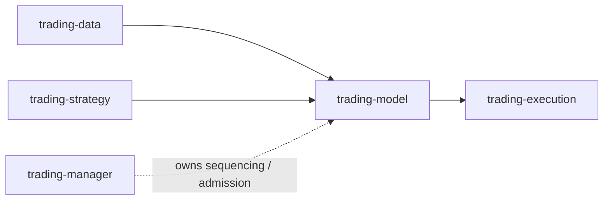
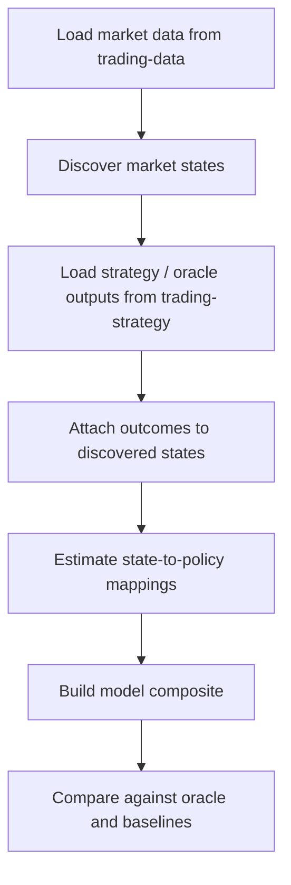

# trading-model

`trading-model` is the offline unsupervised market-state modeling repository for the trading stack.
It discovers recurring market states from upstream market data first, then attaches strategy/oracle outcomes to evaluate whether those states are useful for strategy selection.

## Scope

**Owns**
- market-state discovery logic
- state-evaluation / policy-mapping logic
- model composite construction
- oracle-gap and baseline comparison reporting
- model-side research outputs and artifact contracts

**Does not own**
- raw data acquisition
- strategy execution ownership
- cross-repo workflow sequencing
- survivor-floor / rehydration / archive control-plane ownership
- live execution

## Stack position

## Required inputs
- `trading-data/data/<symbol>/<YYMM>/bars_1min.jsonl`
- `trading-data/data/<symbol>/<YYMM>/_meta.json`
- `trading-strategy/data/<instrument>/<family>/<variant>/<YYMM>/equity.jsonl`
- `trading-strategy/data/<instrument>/<family>/<variant>/<YYMM>/returns.jsonl`

## Optional inputs
- `trading-strategy/data/<instrument>/<family>/<variant>/<YYMM>/meta.json`
- `trading-strategy/data/<instrument>/_runs/run_manifest_*.json`
- global oracle artifacts under `trading-strategy/data/<instrument>/global_oracle/global_oracle/<YYMM>/...`
- future richer market/context artifacts from `trading-data`

## Primary outputs
- state tables under `outputs/` or other configured output roots
- state-evaluation tables under `outputs/`
- winner-mapping artifacts under `outputs/`
- oracle-gap / baseline comparison reports under `outputs/`
- research verdict summaries under `outputs/`
- future standardized downstream-facing judgment fields such as execution confidence / opportunity strength

## Completion artifacts
- final stdout JSON block from model CLI runs
- manager-parsed task output captured in `trading-manager/state/tasks/*.json`

## Research flow

## Current design line

- state discovery uses market-side inputs first
- strategy outputs are attached only after discovery
- model quality is judged mainly by how much model composite value is captured relative to oracle and simple baselines
- cross-repo sequencing and lifecycle policy belong in `trading-manager`, not here

## Documentation

Read in order:
1. `docs/README.md`
2. `docs/01-overview.md`
3. `docs/02-inputs-workflow-and-boundary.md`
4. `docs/03-discovery-evaluation-and-reporting.md`
5. `docs/04-repo-structure-and-implementation-status.md`
6. `docs/05-current-boundary-and-next-phase.md`
