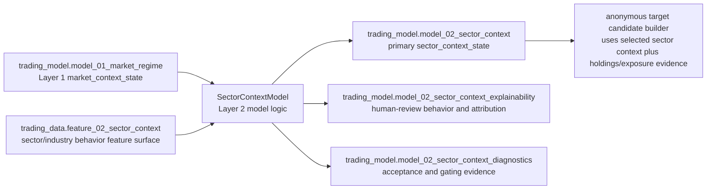

# Layer 02 - SectorContextModel

This file records the active direction-neutral `trading-model` contract and implementation target for Layer 2. The deterministic implementation, SQL writer, evaluation path, and registry surfaces now use the direction-neutral terms below.

## Input

```text
trading_model.model_01_market_regime   # Layer 1 primary output, consumed conceptually as market_context_state
trading_data.feature_02_sector_context
```

Layer 2 needs the Layer 1 output in addition to the Layer 2 data feature surface. `model_01_market_regime` / `market_context_state` is conditioning context only; it should shape interpretation of sector behavior but should not become sector, ETF, stock, or strategy selection by itself.

Layer 2 consumes sector/industry ETF behavior evidence from `feature_02_sector_context`. The data-owned source rows behind that feature surface are provenance/construction evidence, not a separate direct model dependency unless a later accepted contract creates one. ETF holdings and `stock_etf_exposure` belong downstream to anonymous target candidate construction, not Layer 2 core behavior modeling.

## Stage flow



## Physical artifacts

```text
trading_model.model_02_sector_context
trading_model.model_02_sector_context_explainability
trading_model.model_02_sector_context_diagnostics
```

## `model_02_sector_context` - output

The primary output is the narrow, stable downstream contract. It contains identity, direction-neutral trend/tradability state, downstream sector handoff, and eligibility/quality summary fields:

```text
available_time
sector_or_industry_symbol
model_id
model_version
market_context_state_ref
2_sector_relative_direction_score
2_sector_trend_quality_score
2_sector_trend_stability_score
2_sector_transition_risk_score
2_market_context_support_score
2_sector_breadth_confirmation_score
2_sector_internal_dispersion_score
2_sector_crowding_risk_score
2_sector_liquidity_tradability_score
2_sector_tradability_score
2_sector_handoff_state
2_sector_handoff_bias
2_sector_handoff_rank
2_sector_handoff_reason_codes
2_eligibility_state
2_eligibility_reason_codes
2_state_quality_score
2_coverage_score
2_data_quality_score
2_evidence_count
```

`2_sector_relative_direction_score` is signed current sector-context direction evidence. Positive values indicate relative long bias and negative values indicate relative short bias; the sign is not a quality judgment and must not be interpreted as portfolio weight.

`2_market_context_support_score` is direction-aware support for the current sector state, not a bullish-market proxy. A weak market can support a weak/short-bias sector state.

`2_sector_internal_dispersion_score` and `2_sector_crowding_risk_score` are separate because dispersion/fragmentation and one-factor crowding are different risks.

`2_sector_tradability_score` is direction-neutral. It represents how clean, stable, liquid, low-noise, and low-transition-risk the sector context is for downstream anonymous target construction. It replaces legacy `2_selection_readiness_score` semantics in the active implementation.

`2_state_quality_score`, `2_coverage_score`, and `2_data_quality_score` describe reliability/completeness of the produced state row. They are not opportunity scores and must not be blended silently with tradability or direction.

Allowed `2_sector_handoff_state` values are:

```text
selected | watch | blocked | insufficient_data
```

Allowed `2_sector_handoff_bias` values are:

```text
long_bias | short_bias | neutral | mixed
```

`2_sector_handoff_state` and `2_sector_handoff_bias` must stay separate. A stable weak sector can be `selected` with `short_bias`; a fast rising but noisy sector can be `watch` or `blocked` with `long_bias`.

Handoff, eligibility, rank, and reason-code fields are routing/audit outputs, not ordinary raw evidence fields. Research/evaluation should preserve selected, watch, blocked, and neutral/blocked control samples so downstream training does not learn only from preselected states.

## `model_02_sector_context_explainability` - explainability

Explainability owns human-review detail that should not become a hard downstream dependency:

- observed behavior internals such as relative strength, trend direction, volatility-adjusted trend, breadth, dispersion, correlation, and chop;
- inferred attribute internals such as growth/defensive/cyclical/rate/dollar/commodity/risk-appetite sensitivity and attribute certainty;
- conditional behavior internals such as beta, directional coupling, volatility response, capture asymmetry, response convexity, context support, and transition sensitivity;
- contributing evidence and reason-code detail.

## `model_02_sector_context_diagnostics` - diagnostics

Diagnostics owns acceptance, monitoring, and gating evidence:

- liquidity/spread/optionability/capacity/tradability;
- event/gap/volatility/correlation stress and downside-tail risk;
- coverage/freshness/missingness;
- baseline comparison;
- refit stability;
- no-future-leak checks.

## Naming rule

Layer 2 model fields use compact `2_*` names in docs, model-facing payloads, and SQL physical columns. SQL writers should quote numeric-leading column names when needed rather than storing semantic aliases such as `layer02_*`.

## Layer acceptance

Layer 2 changes are acceptable when they:

- consume `trading_model.model_01_market_regime` / `market_context_state` as conditioning context plus `trading_data.feature_02_sector_context` as the deterministic feature surface;
- keep Layer 1 context from becoming sector, ETF, stock, strategy, option, or portfolio selection by itself;
- exclude ETF holdings and `stock_etf_exposure` from core Layer 2 behavior modeling unless a later accepted contract moves that boundary;
- preserve `model_02_sector_context` as the narrow downstream sector-context output and keep explainability/diagnostics as support surfaces;
- keep sector direction, trend quality, transition risk, tradability, state quality, and handoff bias as separate semantics rather than collapsing them into a single readiness score;
- route new shared names, statuses, fields, handoff states, or reason-code vocabularies through `trading-manager/scripts/` before cross-repository dependence.

## Production promotion

`model_02_sector_context` must not become a production-hard downstream dependency until it has a reviewed promotion candidate backed by real-data evaluation evidence. Promotion evidence must include explicit thresholds, metric values, baseline comparison, split/refit stability, sector handoff quality, and no-future-leak checks. Fixture/local dry-run evidence should defer.

Current real-data status: fresh V2.2 `model_02_sector_context` rows were generated from database `feature_02_sector_context` plus `model_01_market_regime` rows, real promotion evidence was built, and promotion review was persisted as **deferred**, not approved. Handoff gates passed (`selected_bias_alignment_rate=0.5543`, `selected_abs_label_lift_vs_blocked=0.00849`, no leakage violations), but production promotion remains blocked by baseline/stability gates (`minimum_baseline_improvement_abs=-0.2988`, `maximum_stability_correlation_range=1.5602`, `minimum_stability_sign_consistency=0.3333`). Fixture/local dry-run evidence must defer.

Current Layer 2 verification covers the V2.2 deterministic generator, SQL physical-artifact writers, direction-neutral promotion evidence builders, and contract boundary checks:

```bash
git diff --check
python3 -m compileall -q src scripts tests
PYTHONPATH=src python3 -m unittest tests.test_sector_context_contract tests.test_sector_context_model tests.test_sector_context_evaluation
rg -n "source_02_sector_context|layer02_|SecuritySelectionModel|security_selection|2_selection_readiness_score|2_trend_certainty_score|2_context_conditioned_stability_score" docs src scripts tests
```
