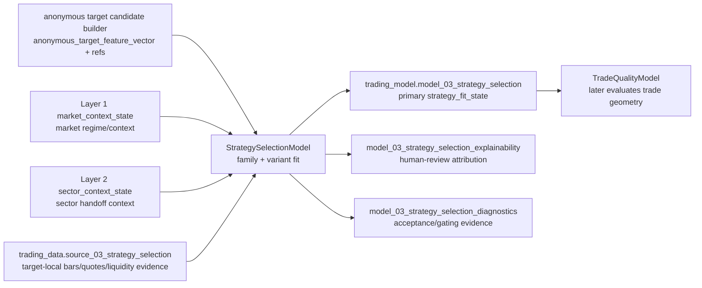

# Layer 03 - StrategySelectionModel

Status: Draft contract for review.

This file records the proposed `trading-model` contract for Layer 3. It is intentionally contract-first: implementation, registry promotion, and cross-repository dependence should wait until this layer shape is accepted.

Model-local detailed strategy catalog:

```text
src/models/model_03_strategy_selection/strategy_family_catalog.md
```

## Purpose

`StrategySelectionModel` answers:

> Given an anonymous target candidate and current market/sector context, which strategy family and variant fit the candidate now?

Layer 3 does **not** choose final entry price, stop, target, option contract, position size, execution policy, or portfolio allocation. Those belong to later layers.

## Input and candidate-preparation boundary

Layer 3 includes the anonymous target candidate builder as its candidate-preparation sub-boundary:

```text
src/models/model_03_strategy_selection/anonymous_target_candidate_builder/
```

Layer 3 input flow:

```text
trading_model.model_02_sector_context      # Layer 2 sector_context_state / basket handoff
+ target/holding/liquidity evidence         # point-in-time candidate construction evidence
-> anonymous_target_candidate_builder       # Layer 3 candidate-prep sub-boundary
-> anonymous target candidates              # StrategySelectionModel fitting inputs

trading_model.model_01_market_regime       # market_context_state reference / factors
trading_data.source_03_strategy_selection  # target-local bars, quotes, liquidity evidence when implemented
```

Because Layer 2 is not yet production-promoted, Layer 3 development may use reviewed fixture/dev evidence and explicit evaluation snapshots, but production hard-dependence on `model_02_sector_context` must wait for accepted Layer 2 promotion or an approved fallback contract.

## Strategy family and variant

Layer 3 should not carry a separate strategy-group level. Families are the unit we test, eliminate, and promote; variants are parameter-neighborhoods inside one family.

| Level | Field | Meaning | Example |
|---|---|---|---|
| Family | `3_strategy_family` | Concrete reusable strategy method. This is the unit with its own parameter design space. | `moving_average_crossover`, `rsi_reversion` |
| Variant | `3_strategy_variant` | One distinguishable parameter-neighborhood generated from a family spec. | `rsi_reversion__tf_1d__period_14__buy_30__sell_70` |

A strategy family is therefore one item in the source strategy list and the standalone pruning/promotion unit.

### `strategy_family`

A strategy family is a stable behavioral edge method. It names the kind of market behavior the model believes can be exploited and owns a bounded parameter design space.

Rules:

- family names describe return/risk mechanism, not instrument identity;
- families must be usable across anonymous target candidates;
- families must not encode ticker, company, sector, issuer, or memorized historical winners;
- families must not name execution products such as `long_call`, `long_put`, `spread`, or `stock_order`;
- families may require specific evidence classes; if the evidence does not exist, the family remains reserved rather than partially implemented;
- families should be durable, but not so broad that their variants mix unrelated mechanisms.

### `strategy_variant`

A strategy variant is a parameter-neighborhood inside one family. It narrows trigger shape, direction, horizon, confirmation requirements, and invalidation style.

Rules:

- every variant belongs to exactly one family;
- variant names describe a reusable setup shape, not a final trade;
- variants may imply directional bias and horizon bucket;
- variants must not specify exact entry/exit prices, option contract terms, position size, or portfolio weights;
- variants should be generated from a reviewed parameter grid with constraints, not from an unbounded Cartesian product;
- variants should be evaluable against baselines and split-stability tests.

## Source strategy mapping

The following mapping turns the supplied strategy list into Layer 3 families. Status indicates whether the family is suitable for the first implementation wave.

| Family | Source item | Status | Notes |
|---|---:|---|---|
| `moving_average_crossover` | 1 | Included | Bar-based, simple, useful baseline. |
| `donchian_channel_breakout` | 2 | Included | Bar-based breakout/trend bridge. |
| `macd_trend` | 3 | Included | Bar-based momentum/trend confirmation. |
| `cross_sectional_momentum` | 4 | Moved-to-position-management | Cross-sectional ranking/rebalancing belongs with portfolio/position selection unless later narrowed to a pure candidate feature. |
| `bollinger_band_reversion` | 5 | Included | Bar-based; must carry trend filter attributes. |
| `rsi_reversion` | 6 | Included | Bar-based; good threshold/period family. |
| `bias_reversion` | 7 | Included | Bar-based distance-from-average family. |
| `vwap_reversion` | 8 | Included-if-Alpaca-intraday | Requires intraday/VWAP and preferably quote/trade liquidity aggregates. |
| `range_breakout` | 9 | Included | Bar-based, volume confirmation optional. |
| `opening_range_breakout` | 10 | Included-if-Alpaca-intraday | Requires 1Min bars, session calendar, and opening-range evidence. |
| `volatility_breakout` | 11 | Included | ATR/HV expansion plus direction filter. |
| `cross_exchange_arbitrage` | 12 | Removed | Explicitly excluded from this strategy-family catalog. |
| `cash_futures_basis_arbitrage` | 13 | Removed | Explicitly excluded from this strategy-family catalog. |
| `funding_rate_arbitrage` | 14 | Removed | Explicitly excluded from this strategy-family catalog. |
| `pairs_statistical_arbitrage` | 15 | Moved-to-position-management | Pair construction, hedge ratio, two-leg sizing, and spread risk belong with position/portfolio management. |
| `grid_trading` | 16 | Removed | Explicitly excluded from this strategy-family catalog. |
| `martingale_anti_martingale` | 17 | Removed | Explicitly excluded; martingale must not be implemented as a standalone family. |
| `passive_market_making` | 18 | Removed | Explicitly excluded from this strategy-family catalog. |
| `scheduled_event_reaction` | 19 | Removed | Explicitly excluded from this Layer 3 strategy-family catalog. |
| `onchain_sentiment_reaction` | 20 | Removed | Explicitly excluded from this Layer 3 strategy-family catalog. |
| `trend_volatility_filter` | 21 | Modifier | Keep as a reusable filter/modifier applied to trend families. |
| `mean_reversion_trend_filter` | 22 | Modifier | Keep as a reusable filter/modifier applied to reversion families. |
| `multi_factor_scoring` | 23 | Meta-family | Keep; useful as ensemble/scoring layer after deterministic family evidence exists. |
| `supervised_direction_classifier` | 24 | Deferred-final-goal | Keep as final target direction; defer until deterministic family baselines and labels are mature. |
| `reinforcement_learning_policy` | 25 | Deferred-final-goal | Keep as final target direction; defer until simulator/reward/environment validation is credible. |

## Included strategy-family catalog

The deterministic strategy-family catalog should include every remaining non-removed family, while separately recording which Alpaca-backed data kinds are required. The core included families are:

```text
moving_average_crossover
donchian_channel_breakout
macd_trend
bollinger_band_reversion
rsi_reversion
bias_reversion
range_breakout
volatility_breakout
```

Included families that require intraday/VWAP/liquidity readiness:

```text
vwap_reversion
opening_range_breakout
```

Position/portfolio-management candidates, removed from Layer 3 standalone strategy-family implementation:

```text
cross_sectional_momentum
pairs_statistical_arbitrage
```

Meta scoring retained for later composition after deterministic family evidence exists:

```text
multi_factor_scoring
```

Deferred final-goal families, retained but not implemented in the deterministic strategy-family wave:

```text
supervised_direction_classifier
reinforcement_learning_policy
```

Removed families should not be implemented in this catalog unless a later accepted architecture reopens their boundary:

```text
cross_exchange_arbitrage
cash_futures_basis_arbitrage
funding_rate_arbitrage
grid_trading
martingale_anti_martingale
passive_market_making
scheduled_event_reaction
onchain_sentiment_reaction
```

The included deterministic Layer 3 catalog therefore contains 10 standalone strategy families plus 3 modifier/meta families. Cross-sectional momentum and pairs/stat-arb are retained as position/portfolio-management candidates, not Layer 3 standalone family implementations. ML/RL remain retained final goals, but deterministic families should establish labels, feature quality, costs, and baselines first.

Evaluation order: standalone families must be tested and pruned before modifiers, meta-scoring, or ensemble logic are allowed to influence selection. Modifier/meta families are retained for later controlled experiments, not for the first pass.

## Variant generation rules

Each family may declare a `max_variants` cap of 500, but the default target should be far lower. The cap is a safety ceiling, not a goal.

Recommended constraints:

- use reviewed parameter grids with constraints such as `fast_window < slow_window`;
- use sparse, information-preserving grids: lookbacks should usually be log-spaced or regime-spaced, not every integer;
- generate parameter neighborhoods, not microscopic one-tick variants;
- avoid variants whose only difference is too small to survive costs/slippage/noise;
- keep direction, signal-bar policy, confirmation, and invalidation parameters explicit;
- store a stable variant spec payload and hash so results are reproducible.

Indicative variant budgets:

| Family | Initial target variants | Hard cap | Main parameter axes |
|---|---:|---:|---|
| `moving_average_crossover` | 864 | 864 reviewed exception | fixed 1Min signal bars, sparse MA window profiles with three intraday points and a long endpoint, price field, MA type, confirmation bars, cooldown bars, minimum slope; no embedded trend filter. |
| `donchian_channel_breakout` | 80-180 | 500 | fixed 1Min signal bars, channel window profiles, breakout buffer, ATR stop proxy, confirmation. |
| `macd_trend` | 120-300 | 500 | fixed 1Min signal bars, MACD profiles, histogram threshold, confirmation, trend filter. |
| `bollinger_band_reversion` | 120-400 | 500 | fixed 1Min signal bars, band window profiles, band width, entry/exit band, trend filter. |
| `rsi_reversion` | 80-240 | 500 | fixed 1Min signal bars, RSI period profiles, thresholds, divergence flag, multi-duration confirmation. |
| `bias_reversion` | 120-400 | 500 | fixed 1Min signal bars, MA window profiles, deviation threshold, normalization, exit threshold, trend filter. |
| `range_breakout` | 120-300 | 500 | fixed 1Min signal bars, range window profiles, breakout buffer, volume confirmation, retest rule. |
| `volatility_breakout` | 80-160 | 500 | fixed 1Min signal bars, volatility profiles, expansion threshold, direction filter, confirmation. |
| `vwap_reversion` | 80-120 | 500 | fixed 1Min signal bars, session VWAP, deviation threshold, liquidity filter, time-of-day bucket. |
| `opening_range_breakout` | 30-80 | 500 | fixed 1Min signal bars, opening range minutes, breakout buffer, time stop, volume/liquidity confirmation. |

Families with fewer meaningful axes should produce fewer variants. Families with many axes should use sampled/curated grids rather than full Cartesian expansion. `moving_average_crossover` is the current reviewed exception because its 864-variant grid is still a simple rule family and is used as the first MA baseline for oracle-gap evaluation.

## Adjustable parameter surface

The first implementation should expose each family through a reviewed spec object. The fields below are the initial interface candidates; implementation may narrow the grids, but should not add unreviewed axes silently.

| Family | Status | Adjustable parameters |
|---|---|---|
| `moving_average_crossover` | Included | fixed `signal_bar_interval=1Min`; variable `ma_window_profile`, `price_field=bar_close/bar_hlc3`, `ma_type=ema/sma`, `crossover_confirmation_bars=1/2/3`, `cooldown_bars=1/3/5`, `min_slope=0.01/0.03/0.05`; fixed `exit_rule`; market/sector context affects strategy selection outside the family rule. |
| `donchian_channel_breakout` | Included | fixed `signal_bar_interval=1Min`, `channel_window_profile`, `breakout_side`, `breakout_buffer_atr`, `confirmation_bars`, `stop_atr_multiple`, `retest_allowed`, `cooldown_bars`. |
| `macd_trend` | Included | fixed `signal_bar_interval=1Min`, `macd_profile`, `histogram_threshold`, `zero_line_filter`, `slope_confirmation_bars`, `trend_filter_window`, `exit_on_signal_cross`, `cooldown_bars`. |
| `bollinger_band_reversion` | Included | fixed `signal_bar_interval=1Min`, `band_window_profile`, `band_stddev`, `entry_band`, `exit_band`, `rsi_filter_period`, `trend_filter_enabled`, `volatility_regime_filter`, `max_hold_minutes`. |
| `rsi_reversion` | Included | fixed `signal_bar_interval=1Min`, `rsi_period_profile`, `oversold_threshold`, `overbought_threshold`, `exit_midline`, `divergence_required`, `multi_duration_confirm`, `max_hold_minutes`, `cooldown_bars`. |
| `bias_reversion` | Included | fixed `signal_bar_interval=1Min`, `ma_window_profile`, `ma_type`, `deviation_measure`, `entry_deviation_threshold`, `exit_deviation_threshold`, `zscore_window`, `trend_filter_enabled`, `max_hold_minutes`. |
| `vwap_reversion` | Included-if-Alpaca-intraday | fixed `signal_bar_interval=1Min`, `vwap_scope`, `deviation_bps`, `entry_zscore`, `exit_zscore`, `time_of_day_bucket`, `minimum_dollar_volume`, `maximum_spread_bps`, `no_trade_after_time`. |
| `range_breakout` | Included | fixed `signal_bar_interval=1Min`, `range_window_profile`, `range_width_max_atr`, `breakout_direction`, `breakout_buffer_atr`, `volume_confirmation_ratio`, `close_confirmation`, `retest_rule`, `failed_breakout_timeout_minutes`, `cooldown_bars`. |
| `opening_range_breakout` | Included-if-Alpaca-intraday | fixed `signal_bar_interval=1Min`, `opening_range_minutes`, `breakout_buffer_bps`, `direction_mode`, `volume_confirmation_ratio`, `first_trade_delay_minutes`, `time_stop_minutes`, `max_trades_per_session`, `liquidity_filter`, `no_trade_after_time`. |
| `volatility_breakout` | Included | fixed `signal_bar_interval=1Min`, `volatility_profile`, `direction_filter`, `confirmation_bars`, `stop_atr_multiple`, `cooldown_bars`, `volatility_cooloff_threshold`. |
| `trend_volatility_filter` | Modifier | `enabled`, `trend_window`, `trend_slope_min`, `volatility_measure`, `volatility_window`, `volatility_min`, `volatility_max`, `applies_to_families`, `filter_mode`. |
| `mean_reversion_trend_filter` | Modifier | `enabled`, `higher_duration_profile`, `higher_duration_trend_window`, `allowed_trend_states`, `pullback_depth_min`, `pullback_depth_max`, `filter_mode`, `applies_to_families`. |
| `multi_factor_scoring` | Meta-family | `factor_set_id`, `factor_weights`, `normalization_method`, `score_window`, `rank_method`, `minimum_score`, `top_quantile`, `rebalance_horizon`, `turnover_penalty`, `correlation_penalty`. |
| `supervised_direction_classifier` | Deferred-final-goal | `model_class`, `feature_set_id`, `label_horizon`, `label_definition`, `train_window`, `validation_scheme`, `probability_threshold`, `calibration_method`, `class_weighting`, `retrain_frequency`. |
| `reinforcement_learning_policy` | Deferred-final-goal | `environment_id`, `state_feature_set_id`, `action_space`, `reward_function_id`, `episode_length`, `transaction_cost_model`, `risk_penalty`, `exploration_schedule`, `policy_class`, `offline_validation_protocol`. |

## Options-oriented intraday defaults

Layer 3 signals are ultimately expected to feed option expression work. Intraday families should therefore prefer cleaner, tradable underlying moves over maximum signal count. These defaults are recommendations; explicitly listed axes may still become `3_strategy_variant` parameters.

### `vwap_reversion`

Recommended default stance for option-targeted use:

| Decision | Recommendation | Variant axis? | Rationale |
|---|---|---|---|
| VWAP scope | `regular_session_vwap` | Yes: allow `regular_session_vwap`, `rolling_vwap_30m`, `rolling_vwap_60m` | Option entries should key off the liquid regular session. Rolling VWAP can be tested, but anchored session VWAP is the clean default. |
| Premarket / after-hours | Exclude from signal VWAP and entry triggers; keep as context only | Yes: `premarket_context_mode = ignore/context_filter` | Underlying premarket prints can distort VWAP, while options are illiquid or unavailable. |
| Entry timing | No entries before 10:00 ET | No | Avoid first-open spread/IV noise before option chains settle; user accepted 10:00 as the fixed default. |
| Close cutoff | No new entries after 15:30 ET | No | VWAP reversion may still work later than opening-range breakout, but should not open into the final close window. |
| Liquidity gate | Require target-relative dollar-volume gating, quote count, and max spread bps | Partly | Option expression later gates option liquidity, but Layer 3 should avoid underlying setups with poor tradability. Dollar volume must be relative to the target's own rolling liquidity, not a universal NVDA/small-cap threshold. |
| Reversion target | Exit/score toward VWAP or mid-band, not final trade exit instruction | Yes: `exit_zscore`, `exit_band` | Layer 3 should score setup fit, not own exact trade management. |

Recommended initial variant axes:

```text
vwap_scope = regular_session_vwap                       # fixed default
premarket_context_mode = context_filter                 # fixed default
deviation_bps = 30 | 50 | 75 | 100                      # variant axis
entry_zscore = 1.0 | 1.5 | 2.0                          # variant axis
exit_zscore = 0.25 | 0.5 | 0.75                         # variant axis
earliest_entry_time = 10:00                             # fixed default
no_trade_after_time = 15:30                             # fixed default
maximum_spread_bps = 5 | 10 | 15                        # variant axis
minimum_dollar_volume = target_relative_liquidity_gate   # dynamic per-symbol gate
time_of_day_bucket = derived label, not a variant axis
```

The derived `time_of_day_bucket` is computed from `available_time` for analysis, calibration, and diagnostics. It should not multiply variants unless evaluation later proves materially different behavior by bucket.

The target-relative liquidity gate should compare the current signal window's dollar volume to that target's own rolling baseline, for example a rolling median/percentile by symbol and 1-minute duration profile. This avoids applying the same absolute threshold to highly liquid names and small/liquidity-constrained names.

### `opening_range_breakout`

Recommended default stance for option-targeted use:

| Decision | Recommendation | Variant axis? | Rationale |
|---|---|---|---|
| Session open | `regular_session_open = 09:30 ET` | No, unless exchange calendar changes | Options-targeted signals should use the regular equity session as the anchor. |
| Premarket inclusion | Exclude from opening range; use premarket gap/volume as optional context filter | Yes: `premarket_context_mode = ignore/context_filter` | Premarket levels matter, but including them in the range mixes illiquid and regular-session behavior. |
| Opening range length | Default 15 minutes | Yes: `opening_range_minutes = 5/15/30/60` | 15m balances early signal with reduced first-minute noise; 5m is faster/noisier, 30/60m cleaner/slower. |
| First trade delay | 5 minutes after range completion | No | Avoid immediate false breaks and unstable option spreads; user accepted 5 minutes as the fixed default. |
| Confirmation | Require close outside range plus volume/liquidity confirmation | Yes for volume ratio | Wick-only breaks are poor option signals; close confirmation reduces false triggers. |
| Time stop | 60 minutes | No | Long options need timely movement; stale breakouts decay; user accepted 60 minutes as fixed default. |
| Max signals | 1 per target/session | No initially | For option-targeted opening-range trades, repeated triggers usually indicate chop; start strict and revisit only if evidence supports a second attempt. |
| Entries near close | No new entries after 11:00 ET | No | Opening-range breakout should be an early-session setup, not an all-day breakout label. |

Recommended initial variant axes:

```text
opening_range_minutes = 5 | 15 | 30 | 60       # variant axis
breakout_buffer_bps = 5 | 10 | 20              # variant axis; keep unless explicitly removed
direction_mode = both                          # fixed default
volume_confirmation_ratio = 1.0 | 1.25 | 1.5 | 2.0  # variant axis
first_trade_delay_minutes = 5                  # fixed default
time_stop_minutes = 60                         # fixed default
max_trades_per_session = 1                     # fixed default
premarket_context_mode = context_filter         # fixed default
no_trade_after_time = 11:00                    # fixed default
liquidity_filter = strict                      # fixed default
```

For both families, the option-specific contract remains downstream: Layer 3 may require underlying tradability and directional/setup quality, but option chain selection, DTE, delta, IV, Greeks, spread, premium, and contract liquidity belong to `OptionExpressionModel`.

Removed families have no exposed parameter interface in Layer 3.

## Moved to position / portfolio management

The following supplied families are not removed from the overall system, but should not be implemented as standalone Layer 3 strategy-family generators:

| Family | Reason for moving | Future owner direction |
|---|---|---|
| `cross_sectional_momentum` | Its core action is ranking a universe, selecting top/bottom buckets, setting rebalance cadence, and controlling turnover. That is closer to multi-target selection and allocation than single-candidate setup classification. | Position/portfolio management may consume momentum ranks as allocation evidence; Layer 3 may still expose target-local momentum features. |
| `pairs_statistical_arbitrage` | Its core action is constructing a pair, estimating hedge ratio, sizing two legs, and managing spread/borrow/cost risk. That is a portfolio/position structure, not a single anonymous-candidate setup. | Position/portfolio management may later own pair universe, pair sizing, spread risk, and unwind rules. |

If a later contract narrows either family into pure single-candidate evidence, that evidence should be named as a feature block, not as a standalone Layer 3 family.

## Alpaca-backed data support surface

Strategy support should be judged from what Alpaca can acquire, not from whichever tables happen to be populated today. Current accepted Alpaca data kinds in `trading-data` are:

- `equity_bar`: OHLCV/VWAP bars for stocks and ETFs.
- `equity_trade`: raw trades, used transiently by the liquidity feed.
- `equity_quote`: raw quotes, used transiently by the liquidity feed.
- `equity_snapshot`: latest trade/quote/minute/daily/previous-daily snapshot.
- `equity_news`: stock/ETF news feed; retained for future ML/news features, but event-driven strategy families are removed from this Layer 3 catalog.

`02_feed_alpaca_liquidity` aggregates transient trades/quotes into `equity_liquidity_bar` fields such as trade count, quote count, volume, VWAP, OHLC, average bid/ask/mid/spread, last bid/ask/mid, and VWAP-minus-mid. Raw high-volume trade/quote rows should not be persisted by default.

Alpaca support by remaining family:

| Family | Required Alpaca data kinds | Support judgment | Notes |
|---|---|---|---|
| `moving_average_crossover` | `equity_bar` | Supported | Needs adjusted OHLCV bars and enough history for slow windows. |
| `donchian_channel_breakout` | `equity_bar` | Supported | Needs high/low history and optional ATR from bars. |
| `macd_trend` | `equity_bar` | Supported | Needs close history. |
| `bollinger_band_reversion` | `equity_bar` | Supported | Needs close history; trend/vol filters also bar-derived. |
| `rsi_reversion` | `equity_bar` | Supported | Needs close history. |
| `bias_reversion` | `equity_bar` | Supported | Needs close and MA history. |
| `vwap_reversion` | `equity_bar`; preferably `equity_trade`/`equity_quote` -> `equity_liquidity_bar` | Source data supported | No new Alpaca data kind is missing; implementation must define session/VWAP scope, spread/liquidity gates, and no-trade time rules. |
| `range_breakout` | `equity_bar`; optional `equity_liquidity_bar` | Supported | Volume confirmation and range width are bar-derived. |
| `opening_range_breakout` | `equity_bar` at 1Min; optional `equity_liquidity_bar` | Source data supported | No new Alpaca data kind is missing; implementation must define regular-session open, opening range, premarket inclusion/exclusion, confirmation, and time-stop rules. |
| `volatility_breakout` | `equity_bar`; optional `equity_liquidity_bar` | Supported | ATR/HV are bar-derived; liquidity can gate tradability. |
| `trend_volatility_filter` | `equity_bar` | Supported | Derived from trend and volatility windows. |
| `mean_reversion_trend_filter` | `equity_bar` | Supported | Derived from higher-duration trend and pullback depth over reviewed 1-minute windows. |
| `multi_factor_scoring` | `equity_bar`, `equity_liquidity_bar`, optional `equity_snapshot` | Supported for technical/liquidity factors | Fundamental/event/sentiment factor sets require non-Alpaca or deferred data. |
| `supervised_direction_classifier` | `equity_bar`, `equity_liquidity_bar`, optional `equity_snapshot`, optional `equity_news` | Data-supported but deferred | Alpaca can supply many features/labels; modeling governance remains deferred. |
| `reinforcement_learning_policy` | `equity_bar`, `equity_liquidity_bar`, optional snapshots/news | Data-supported but deferred | Requires simulator/action/reward validation before implementation. |

## Direction and horizon attributes

Family and variant are not enough by themselves. Layer 3 should also emit reviewed attributes:

| Field | Values | Role |
|---|---|---|
| `3_strategy_family` | reviewed family vocabulary | Concrete strategy method with its own parameter design space. |
| `3_strategy_variant` | generated stable variant id/name | Distinguishable parameter-neighborhood inside one family. |
| `3_direction_bias` | `bullish`, `bearish`, `two_sided`, `neutral` | Direction implied by current candidate/setup evidence. |
| `3_horizon_bucket` | `intraday`, `swing_1_5d`, `swing_5_20d` | Approximate holding/evaluation horizon bucket. |
| `3_trigger_style` | `continuation`, `pullback`, `breakout`, `reversion`, `rotation` | Setup trigger shape; descriptive, not an order instruction. |
| `3_invalidation_style` | `trend_break`, `range_reentry`, `volatility_failure`, `relative_strength_failure`, `data_quality_failure` | How the setup becomes invalid conceptually. |

These are model-facing Layer 3 fields and should use compact `3_*` names in docs, payloads, and SQL physical columns if promoted. SQL writers should quote numeric-leading columns rather than creating `layer03_*` aliases.

## Proposed primary output

```text
trading_model.model_03_strategy_selection
```

Conceptual primary key:

```text
model_03_strategy_selection[available_time, target_candidate_id, 3_strategy_family, 3_strategy_variant]
```

A candidate may receive multiple family/variant rows. Layer 3 ranks and gates strategy fit; it does not collapse directly to one final trade.

Recommended V1 fields:

```text
available_time
target_candidate_id
model_id
model_version
candidate_builder_version
market_context_state_ref
sector_context_state_ref
3_strategy_family
3_strategy_variant
3_direction_bias
3_horizon_bucket
3_trigger_style
3_invalidation_style
3_family_fit_score
3_variant_fit_score
3_strategy_fit_rank
3_strategy_eligibility_state
3_strategy_eligibility_reason_codes
3_parameter_neighborhood_id
3_parameter_stability_score
3_robustness_score
3_state_quality_score
3_evidence_count
```

Allowed `3_strategy_eligibility_state` values:

```text
eligible | watch | disabled | insufficient_data
```

## Support surfaces

Layer 3 should keep primary downstream output narrow. Human review and diagnostics should live in support tables when implemented:

```text
trading_model.model_03_strategy_selection_explainability
trading_model.model_03_strategy_selection_diagnostics
```

Explainability may include factor attribution, family/variant score components, confirmation failures, and competing variant reasons.

Diagnostics may include baseline comparison, split/refit stability, parameter-neighborhood stability, label coverage, no-future-leak checks, class imbalance, slippage/cost sensitivity, and anonymity checks inherited from the candidate builder.

## Evaluation labels

Layer 3 labels must evaluate strategy fit, not final execution quality. Initial labels should be setup-level and horizon-aware:

| Label | Meaning |
|---|---|
| `future_strategy_directional_edge` | Forward target move in the emitted direction after conservative cost/slippage adjustment. |
| `future_variant_success_state` | Whether the variant's conceptual setup succeeded before invalidation. |
| `future_adverse_excursion_bucket` | Whether adverse movement stayed inside the variant's expected tolerance. |
| `future_relative_strategy_edge` | Performance relative to market/sector/eligible-candidate baseline. |

Trade outcome quality, exact target/stop, MFE/MAE geometry, and holding-period instruction belong to `TradeQualityModel`, not Layer 3, except as coarse evaluation labels.

## Stage flow



## Layer acceptance

Layer 3 changes are acceptable when they:

- consume anonymous target candidates instead of raw ticker/company identity as model-facing inputs;
- preserve audit/routing symbol metadata outside fitting vectors;
- keep conceptual `strategy_family` and `strategy_variant` / model-facing `3_strategy_family` and `3_strategy_variant` as setup classification, not execution or option-expression decisions;
- prove point-in-time construction for all features and labels;
- compare every family/variant against market-only, sector-only, and candidate-only baselines;
- include split/refit stability and parameter-neighborhood stability evidence;
- show no-future-leak and anonymity checks before promotion;
- route accepted shared names, fields, statuses, and artifacts through `trading-manager/scripts/registry/` before downstream repositories depend on them.

## Current verification

Draft-level verification:

```bash
git diff --check
rg -n "layer03_" docs src scripts tests
```

Any Layer 3 implementation review should also inspect that execution-product, sizing, and portfolio-allocation terms remain excluded from model-facing output fields.
