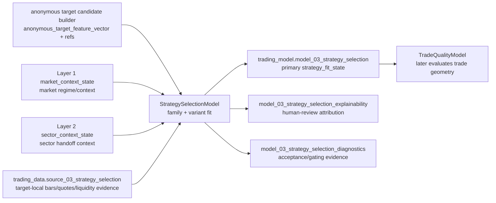

# Layer 03 - StrategySelectionModel

Status: Draft contract for review.

This file records the proposed `trading-model` contract for Layer 3. It is intentionally contract-first: implementation, registry promotion, and cross-repository dependence should wait until this layer shape is accepted.

## Purpose

`StrategySelectionModel` answers:

> Given an anonymous target candidate and current market/sector context, which strategy family and variant fit the candidate now?

Layer 3 does **not** choose final entry price, stop, target, option contract, position size, execution policy, or portfolio allocation. Those belong to later layers.

## Input boundary

```text
anonymous_target_candidate_builder output
trading_model.model_01_market_regime       # market_context_state reference / factors
trading_model.model_02_sector_context      # sector_context_state reference / handoff context
trading_data.source_03_strategy_selection  # target-local bars, quotes, liquidity evidence when implemented
```

Because Layer 2 is not yet production-promoted, Layer 3 development may use reviewed fixture/dev evidence and explicit evaluation snapshots, but production hard-dependence on `model_02_sector_context` must wait for accepted Layer 2 promotion or an approved fallback contract.

## Strategy group, family, and variant

The user-facing strategy list should not be flattened into one level. Layer 3 needs three levels:

| Level | Field | Meaning | Example |
|---|---|---|---|
| Group | `3_strategy_group` | Broad behavioral class used for reporting and coverage control. | `trend_following`, `mean_reversion` |
| Family | `3_strategy_family` | Concrete reusable strategy method. This is the unit with its own parameter design space. | `moving_average_crossover`, `rsi_reversion` |
| Variant | `3_strategy_variant` | One distinguishable parameter-neighborhood generated from a family spec. | `rsi_reversion__tf_1d__period_14__buy_30__sell_70` |

A strategy family is therefore closer to one item in the source strategy list, not merely the broad section header. A strategy group is the broad section header.

### `strategy_family`

A strategy family is a stable behavioral edge method. It names the kind of market behavior the model believes can be exploited and owns a bounded parameter design space.

Rules:

- family names describe return/risk mechanism, not instrument identity;
- families must be usable across anonymous target candidates;
- families must not encode ticker, company, sector, issuer, or memorized historical winners;
- families must not name execution products such as `long_call`, `long_put`, `spread`, or `stock_order`;
- families may require specific evidence classes; if the evidence does not exist, the family remains reserved rather than partially implemented;
- families should be durable, but not so broad that their variants mix unrelated mechanisms.

### `strategy_variant`

A strategy variant is a parameter-neighborhood inside one family. It narrows trigger shape, direction, horizon, confirmation requirements, and invalidation style.

Rules:

- every variant belongs to exactly one family;
- variant names describe a reusable setup shape, not a final trade;
- variants may imply directional bias and horizon bucket;
- variants must not specify exact entry/exit prices, option contract terms, position size, or portfolio weights;
- variants should be generated from a reviewed parameter grid with constraints, not from an unbounded Cartesian product;
- variants should be evaluable against baselines and split-stability tests.

## Source strategy taxonomy

The following taxonomy maps the supplied strategy list into Layer 3 groups/families. Status indicates whether the family is suitable for the first implementation wave.

| Group | Family | Source item | Status | Notes |
|---|---|---:|---|---|
| `trend_following` | `moving_average_crossover` | 1 | V1 | Bar-based, simple, useful baseline. |
| `trend_following` | `donchian_channel_breakout` | 2 | V1 | Bar-based breakout/trend bridge. |
| `trend_following` | `macd_trend` | 3 | V1 | Bar-based momentum/trend confirmation. |
| `trend_following` | `cross_sectional_momentum` | 4 | V1 | Needs candidate/basket peer set; fits anonymous candidate ranking. |
| `mean_reversion` | `bollinger_band_reversion` | 5 | V1 | Bar-based; must carry trend filter attributes. |
| `mean_reversion` | `rsi_reversion` | 6 | V1 | Bar-based; good threshold/period family. |
| `mean_reversion` | `bias_reversion` | 7 | V1 | Bar-based distance-from-average family. |
| `mean_reversion` | `vwap_reversion` | 8 | V1-if-intraday | Requires intraday/VWAP quality and execution-cost diagnostics. |
| `breakout_volatility` | `range_breakout` | 9 | V1 | Bar-based, volume confirmation optional. |
| `breakout_volatility` | `opening_range_breakout` | 10 | V1-if-intraday | Requires intraday session calendar and opening-range evidence. |
| `breakout_volatility` | `volatility_breakout` | 11 | V1 | ATR/HV expansion plus direction filter. |
| `relative_value` | `cross_exchange_arbitrage` | 12 | Removed | Explicitly excluded from this strategy-family catalog. |
| `relative_value` | `cash_futures_basis_arbitrage` | 13 | Removed | Explicitly excluded from this strategy-family catalog. |
| `relative_value` | `funding_rate_arbitrage` | 14 | Removed | Explicitly excluded from this strategy-family catalog. |
| `relative_value` | `pairs_statistical_arbitrage` | 15 | V2-candidate | Keep; pair/spread behavior is a modelable family once pair universe and spread-stability evidence exist. |
| `market_making` | `grid_trading` | 16 | Removed | Explicitly excluded from this strategy-family catalog. |
| `market_making` | `martingale_anti_martingale` | 17 | Removed | Explicitly excluded; martingale must not be implemented as a standalone family. |
| `market_making` | `passive_market_making` | 18 | Removed | Explicitly excluded from this strategy-family catalog. |
| `event_driven` | `scheduled_event_reaction` | 19 | Removed | Explicitly excluded from this Layer 3 strategy-family catalog. |
| `event_driven` | `onchain_sentiment_reaction` | 20 | Removed | Explicitly excluded from this Layer 3 strategy-family catalog. |
| `composite_filter` | `trend_volatility_filter` | 21 | Modifier | Keep as a reusable filter/modifier applied to trend families. |
| `composite_filter` | `mean_reversion_trend_filter` | 22 | Modifier | Keep as a reusable filter/modifier applied to reversion families. |
| `composite_filter` | `multi_factor_scoring` | 23 | Meta-family | Keep; useful as ensemble/scoring layer after deterministic family evidence exists. |
| `ml_enhanced` | `supervised_direction_classifier` | 24 | Deferred-final-goal | Keep as final target direction; defer until deterministic family baselines and labels are mature. |
| `ml_enhanced` | `reinforcement_learning_policy` | 25 | Deferred-final-goal | Keep as final target direction; defer until simulator/reward/environment validation is credible. |

## V1 implementation wave

V1 should implement enough families to cover distinct mechanisms without pretending every source item is equally ready. Recommended first wave:

```text
moving_average_crossover
donchian_channel_breakout
macd_trend
cross_sectional_momentum
bollinger_band_reversion
rsi_reversion
bias_reversion
range_breakout
volatility_breakout
```

Conditional V1 families, only if the data surface proves sufficient:

```text
vwap_reversion
opening_range_breakout
```

V2 candidates after V1 evidence stabilizes:

```text
pairs_statistical_arbitrage
multi_factor_scoring
```

Deferred final-goal families, retained but not implemented in the deterministic strategy-family wave:

```text
supervised_direction_classifier
reinforcement_learning_policy
```

Removed families should not be implemented in this catalog unless a later accepted architecture reopens their boundary:

```text
cross_exchange_arbitrage
cash_futures_basis_arbitrage
funding_rate_arbitrage
grid_trading
martingale_anti_martingale
passive_market_making
scheduled_event_reaction
onchain_sentiment_reaction
```

The first implementation should therefore target 9 core families, with up to 11 if intraday/VWAP evidence is ready. This is broad enough to cover trend, reversion, breakout, volatility, and rotation, while avoiding venue-arbitrage, market-making, martingale, event, and deferred ML/RL dependencies that the current system cannot honestly evaluate yet.

## Variant generation rules

Each family may declare a `max_variants` cap of 500, but the default target should be far lower. The cap is a safety ceiling, not a goal.

Recommended constraints:

- use reviewed parameter grids with constraints such as `fast_window < slow_window`;
- use sparse, information-preserving grids: lookbacks should usually be log-spaced or regime-spaced, not every integer;
- generate parameter neighborhoods, not microscopic one-tick variants;
- avoid variants whose only difference is too small to survive costs/slippage/noise;
- keep direction, timeframe, confirmation, and invalidation parameters explicit;
- store a stable variant spec payload and hash so results are reproducible.

Indicative V1 variant budgets:

| Family | Initial target variants | Hard cap | Main parameter axes |
|---|---:|---:|---|
| `moving_average_crossover` | 40-120 | 500 | timeframe, fast window, slow window, MA type, confirmation bars, trend filter. |
| `donchian_channel_breakout` | 40-100 | 500 | channel window, breakout buffer, exit window, ATR stop proxy, confirmation. |
| `macd_trend` | 30-90 | 500 | fast/slow/signal windows, histogram threshold, confirmation, trend filter. |
| `cross_sectional_momentum` | 40-120 | 500 | ranking lookback, skip window, top/bottom quantile, rebalance horizon, volatility filter. |
| `bollinger_band_reversion` | 40-120 | 500 | window, band width, entry band, exit band, trend filter, volatility filter. |
| `rsi_reversion` | 40-120 | 500 | RSI period, entry/exit thresholds, divergence flag, multi-timeframe confirmation. |
| `bias_reversion` | 30-90 | 500 | MA window, deviation threshold, normalization, exit threshold, trend filter. |
| `range_breakout` | 40-100 | 500 | range lookback, breakout buffer, volume confirmation, retest rule, invalidation. |
| `volatility_breakout` | 40-100 | 500 | ATR/HV window, expansion threshold, direction filter, confirmation, cooldown. |
| `vwap_reversion` | 30-80 | 500 | session/window VWAP, deviation threshold, liquidity filter, time-of-day bucket. |
| `opening_range_breakout` | 30-80 | 500 | opening range minutes, breakout buffer, time stop, volume/liquidity confirmation. |

Families with fewer meaningful axes should produce fewer variants. Families with many axes should use sampled/curated grids rather than full Cartesian expansion.

## Adjustable parameter surface

The first implementation should expose each family through a reviewed spec object. The fields below are the initial interface candidates; implementation may narrow the grids, but should not add unreviewed axes silently.

| Family | Status | Adjustable parameters |
|---|---|---|
| `moving_average_crossover` | V1 | `timeframe`, `fast_window`, `slow_window`, `ma_type`, `price_field`, `crossover_confirmation_bars`, `min_slope`, `trend_filter_enabled`, `trend_filter_window`, `exit_rule`, `cooldown_bars`. |
| `donchian_channel_breakout` | V1 | `timeframe`, `entry_channel_window`, `exit_channel_window`, `breakout_side`, `breakout_buffer_atr`, `confirmation_bars`, `atr_window`, `stop_atr_multiple`, `retest_allowed`, `cooldown_bars`. |
| `macd_trend` | V1 | `timeframe`, `fast_ema_window`, `slow_ema_window`, `signal_window`, `histogram_threshold`, `zero_line_filter`, `slope_confirmation_bars`, `trend_filter_window`, `exit_on_signal_cross`, `cooldown_bars`. |
| `cross_sectional_momentum` | V1 | `timeframe`, `ranking_lookback`, `skip_window`, `rebalance_horizon`, `selection_quantile`, `minimum_rank_gap`, `volatility_adjustment`, `sector_neutralization`, `liquidity_filter`, `turnover_limit`. |
| `bollinger_band_reversion` | V1 | `timeframe`, `window`, `band_stddev`, `entry_band`, `exit_band`, `rsi_filter_period`, `trend_filter_window`, `volatility_regime_filter`, `max_hold_bars`, `stop_band_extension`. |
| `rsi_reversion` | V1 | `timeframe`, `rsi_period`, `oversold_threshold`, `overbought_threshold`, `exit_midline`, `divergence_required`, `multi_timeframe_confirm`, `trend_filter_window`, `max_hold_bars`, `cooldown_bars`. |
| `bias_reversion` | V1 | `timeframe`, `ma_window`, `ma_type`, `deviation_measure`, `entry_deviation_threshold`, `exit_deviation_threshold`, `zscore_window`, `trend_filter_window`, `max_hold_bars`, `stop_deviation_threshold`. |
| `vwap_reversion` | Conditional V1 | `timeframe`, `vwap_scope`, `deviation_bps`, `entry_zscore`, `exit_zscore`, `time_of_day_bucket`, `minimum_dollar_volume`, `maximum_spread_bps`, `max_hold_bars`, `no_trade_near_close_minutes`. |
| `range_breakout` | V1 | `timeframe`, `range_lookback`, `range_width_max_atr`, `breakout_direction`, `breakout_buffer_atr`, `volume_confirmation_ratio`, `close_confirmation`, `retest_rule`, `failed_breakout_timeout`, `cooldown_bars`. |
| `opening_range_breakout` | Conditional V1 | `timeframe`, `opening_range_minutes`, `breakout_buffer_bps`, `direction_mode`, `volume_confirmation_ratio`, `first_trade_delay_minutes`, `time_stop_minutes`, `max_trades_per_session`, `liquidity_filter`, `no_trade_after_time`. |
| `volatility_breakout` | V1 | `timeframe`, `volatility_measure`, `volatility_window`, `expansion_threshold`, `atr_window`, `direction_filter`, `confirmation_bars`, `stop_atr_multiple`, `cooldown_bars`, `volatility_cooloff_threshold`. |
| `pairs_statistical_arbitrage` | V2-candidate | `pair_universe_id`, `lookback_window`, `spread_model`, `hedge_ratio_method`, `entry_zscore`, `exit_zscore`, `stop_zscore`, `correlation_min`, `cointegration_pvalue_max`, `rebalance_horizon`, `borrow_cost_filter`. |
| `trend_volatility_filter` | Modifier | `enabled`, `trend_window`, `trend_slope_min`, `volatility_measure`, `volatility_window`, `volatility_min`, `volatility_max`, `applies_to_families`, `filter_mode`. |
| `mean_reversion_trend_filter` | Modifier | `enabled`, `higher_timeframe`, `higher_timeframe_trend_window`, `allowed_trend_states`, `pullback_depth_min`, `pullback_depth_max`, `filter_mode`, `applies_to_families`. |
| `multi_factor_scoring` | Meta-family | `factor_set_id`, `factor_weights`, `normalization_method`, `score_window`, `rank_method`, `minimum_score`, `top_quantile`, `rebalance_horizon`, `turnover_penalty`, `correlation_penalty`. |
| `supervised_direction_classifier` | Deferred-final-goal | `model_class`, `feature_set_id`, `label_horizon`, `label_definition`, `train_window`, `validation_scheme`, `probability_threshold`, `calibration_method`, `class_weighting`, `retrain_frequency`. |
| `reinforcement_learning_policy` | Deferred-final-goal | `environment_id`, `state_feature_set_id`, `action_space`, `reward_function_id`, `episode_length`, `transaction_cost_model`, `risk_penalty`, `exploration_schedule`, `policy_class`, `offline_validation_protocol`. |

Removed families have no exposed parameter interface in Layer 3.

## Direction and horizon attributes

Family and variant are not enough by themselves. Layer 3 should also emit reviewed attributes:

| Field | Values | Role |
|---|---|---|
| `3_strategy_group` | reviewed group vocabulary | Broad class for coverage/reporting; not enough by itself to define a strategy. |
| `3_strategy_family` | reviewed family vocabulary | Concrete strategy method with its own parameter design space. |
| `3_strategy_variant` | generated stable variant id/name | Distinguishable parameter-neighborhood inside one family. |
| `3_direction_bias` | `bullish`, `bearish`, `two_sided`, `neutral` | Direction implied by current candidate/setup evidence. |
| `3_horizon_bucket` | `intraday`, `swing_1_5d`, `swing_5_20d` | Approximate holding/evaluation horizon bucket. |
| `3_trigger_style` | `continuation`, `pullback`, `breakout`, `reversion`, `rotation` | Setup trigger shape; descriptive, not an order instruction. |
| `3_invalidation_style` | `trend_break`, `range_reentry`, `volatility_failure`, `relative_strength_failure`, `data_quality_failure` | How the setup becomes invalid conceptually. |

These are model-facing Layer 3 fields and should use compact `3_*` names in docs, payloads, and SQL physical columns if promoted. SQL writers should quote numeric-leading columns rather than creating `layer03_*` aliases.

## Proposed primary output

```text
trading_model.model_03_strategy_selection
```

Conceptual primary key:

```text
model_03_strategy_selection[available_time, target_candidate_id, 3_strategy_family, 3_strategy_variant]
```

A candidate may receive multiple family/variant rows. Layer 3 ranks and gates strategy fit; it does not collapse directly to one final trade.

Recommended V1 fields:

```text
available_time
target_candidate_id
model_id
model_version
candidate_builder_version
market_context_state_ref
sector_context_state_ref
3_strategy_group
3_strategy_family
3_strategy_variant
3_direction_bias
3_horizon_bucket
3_trigger_style
3_invalidation_style
3_family_fit_score
3_variant_fit_score
3_strategy_fit_rank
3_strategy_eligibility_state
3_strategy_eligibility_reason_codes
3_parameter_neighborhood_id
3_parameter_stability_score
3_robustness_score
3_state_quality_score
3_evidence_count
```

Allowed `3_strategy_eligibility_state` values:

```text
eligible | watch | disabled | insufficient_data
```

## Support surfaces

Layer 3 should keep primary downstream output narrow. Human review and diagnostics should live in support tables when implemented:

```text
trading_model.model_03_strategy_selection_explainability
trading_model.model_03_strategy_selection_diagnostics
```

Explainability may include factor attribution, family/variant score components, confirmation failures, and competing variant reasons.

Diagnostics may include baseline comparison, split/refit stability, parameter-neighborhood stability, label coverage, no-future-leak checks, class imbalance, slippage/cost sensitivity, and anonymity checks inherited from the candidate builder.

## Evaluation labels

Layer 3 labels must evaluate strategy fit, not final execution quality. Initial labels should be setup-level and horizon-aware:

| Label | Meaning |
|---|---|
| `future_strategy_directional_edge` | Forward target move in the emitted direction after conservative cost/slippage adjustment. |
| `future_variant_success_state` | Whether the variant's conceptual setup succeeded before invalidation. |
| `future_adverse_excursion_bucket` | Whether adverse movement stayed inside the variant's expected tolerance. |
| `future_relative_strategy_edge` | Performance relative to market/sector/eligible-candidate baseline. |

Trade outcome quality, exact target/stop, MFE/MAE geometry, and holding-period instruction belong to `TradeQualityModel`, not Layer 3, except as coarse evaluation labels.

## Stage flow



## Layer acceptance

Layer 3 changes are acceptable when they:

- consume anonymous target candidates instead of raw ticker/company identity as model-facing inputs;
- preserve audit/routing symbol metadata outside fitting vectors;
- keep conceptual `strategy_family` and `strategy_variant` / model-facing `3_strategy_family` and `3_strategy_variant` as setup classification, not execution or option-expression decisions;
- prove point-in-time construction for all features and labels;
- compare every family/variant against market-only, sector-only, and candidate-only baselines;
- include split/refit stability and parameter-neighborhood stability evidence;
- show no-future-leak and anonymity checks before promotion;
- route accepted shared names, fields, statuses, and artifacts through `trading-manager/scripts/registry/` before downstream repositories depend on them.

## Current verification

Draft-level verification:

```bash
git diff --check
rg -n "layer03_" docs src scripts tests
```

Any Layer 3 implementation review should also inspect that execution-product, sizing, and portfolio-allocation terms remain excluded from model-facing output fields.
