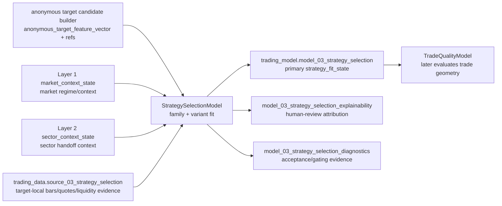

# Layer 03 - StrategySelectionModel

Status: Draft contract for review.

This file records the proposed `trading-model` contract for Layer 3. It is intentionally contract-first: implementation, registry promotion, and cross-repository dependence should wait until this layer shape is accepted.

## Purpose

`StrategySelectionModel` answers:

> Given an anonymous target candidate and current market/sector context, which strategy family and variant fit the candidate now?

Layer 3 does **not** choose final entry price, stop, target, option contract, position size, execution policy, or portfolio allocation. Those belong to later layers.

## Input boundary

```text
anonymous_target_candidate_builder output
trading_model.model_01_market_regime       # market_context_state reference / factors
trading_model.model_02_sector_context      # sector_context_state reference / handoff context
trading_data.source_03_strategy_selection  # target-local bars, quotes, liquidity evidence when implemented
```

Because Layer 2 is not yet production-promoted, Layer 3 development may use reviewed fixture/dev evidence and explicit evaluation snapshots, but production hard-dependence on `model_02_sector_context` must wait for accepted Layer 2 promotion or an approved fallback contract.

## Strategy family vs variant

The conceptual terms are `strategy_family` and `strategy_variant`. Layer 3 model-facing output fields should use the compact layer-owned names `3_strategy_family` and `3_strategy_variant` once promoted.

### `strategy_family`

A strategy family is a stable behavioral edge archetype. It names the kind of market behavior the model believes can be exploited.

Rules:

- family names describe return/risk mechanism, not instrument identity;
- families must be usable across anonymous target candidates;
- families must not encode ticker, company, sector, issuer, or memorized historical winners;
- families must not name execution products such as `long_call`, `long_put`, `spread`, or `stock_order`;
- families should be few and durable.

### `strategy_variant`

A strategy variant is a parameter-neighborhood inside one family. It narrows trigger shape, direction, horizon, confirmation requirements, and invalidation style.

Rules:

- every variant belongs to exactly one family;
- variant names describe a reusable setup shape, not a final trade;
- variants may imply directional bias and horizon bucket;
- variants must not specify exact entry/exit prices, option contract terms, position size, or portfolio weights;
- variants should be evaluable against baselines and split-stability tests.

## V1 taxonomy

V1 should stay small enough to evaluate honestly. The first accepted taxonomy should include four families and twelve variants.

| Family | Role | V1 variants |
|---|---|---|
| `trend_continuation` | Continue an already established directional move when context supports persistence. | `trend_continuation_momentum_persistence`, `trend_continuation_pullback_reentry`, `trend_continuation_breakout_followthrough` |
| `mean_reversion` | Fade stretched moves when evidence favors return toward a local/contextual baseline. | `mean_reversion_oversold_bounce`, `mean_reversion_overbought_fade`, `mean_reversion_range_edge_reversion` |
| `breakout_expansion` | Favor expansion after compression, range pressure, or confirmed level escape. | `breakout_expansion_range_break`, `breakout_expansion_volatility_squeeze`, `breakout_expansion_gap_continuation` |
| `relative_rotation` | Prefer candidates whose relative behavior improves or deteriorates versus sector/market peers. | `relative_rotation_sector_leadership`, `relative_rotation_lag_recovery`, `relative_rotation_pair_spread_reversion` |

Reserved/future families should not enter V1 until their evidence and labels exist:

- `event_reaction` - waits for mature event-overlay evidence;
- `volatility_premium` - waits for option/IV-specific evidence and non-directional option-expression support;
- `capital_structure_relative_value` - out of scope for current equity/ETF/option V1.

## Direction and horizon attributes

Family and variant are not enough by themselves. Layer 3 should also emit reviewed attributes:

| Field | Values | Role |
|---|---|---|
| `3_direction_bias` | `bullish`, `bearish`, `two_sided`, `neutral` | Direction implied by current candidate/setup evidence. |
| `3_horizon_bucket` | `intraday`, `swing_1_5d`, `swing_5_20d` | Approximate holding/evaluation horizon bucket. |
| `3_trigger_style` | `continuation`, `pullback`, `breakout`, `reversion`, `rotation` | Setup trigger shape; descriptive, not an order instruction. |
| `3_invalidation_style` | `trend_break`, `range_reentry`, `volatility_failure`, `relative_strength_failure`, `data_quality_failure` | How the setup becomes invalid conceptually. |

These are model-facing Layer 3 fields and should use compact `3_*` names in docs, payloads, and SQL physical columns if promoted. SQL writers should quote numeric-leading columns rather than creating `layer03_*` aliases.

## Proposed primary output

```text
trading_model.model_03_strategy_selection
```

Conceptual primary key:

```text
model_03_strategy_selection[available_time, target_candidate_id, 3_strategy_family, 3_strategy_variant]
```

A candidate may receive multiple family/variant rows. Layer 3 ranks and gates strategy fit; it does not collapse directly to one final trade.

Recommended V1 fields:

```text
available_time
target_candidate_id
model_id
model_version
candidate_builder_version
market_context_state_ref
sector_context_state_ref
3_strategy_family
3_strategy_variant
3_direction_bias
3_horizon_bucket
3_trigger_style
3_invalidation_style
3_family_fit_score
3_variant_fit_score
3_strategy_fit_rank
3_strategy_eligibility_state
3_strategy_eligibility_reason_codes
3_parameter_neighborhood_id
3_parameter_stability_score
3_robustness_score
3_state_quality_score
3_evidence_count
```

Allowed `3_strategy_eligibility_state` values:

```text
eligible | watch | disabled | insufficient_data
```

## Support surfaces

Layer 3 should keep primary downstream output narrow. Human review and diagnostics should live in support tables when implemented:

```text
trading_model.model_03_strategy_selection_explainability
trading_model.model_03_strategy_selection_diagnostics
```

Explainability may include factor attribution, family/variant score components, confirmation failures, and competing variant reasons.

Diagnostics may include baseline comparison, split/refit stability, parameter-neighborhood stability, label coverage, no-future-leak checks, class imbalance, slippage/cost sensitivity, and anonymity checks inherited from the candidate builder.

## Evaluation labels

Layer 3 labels must evaluate strategy fit, not final execution quality. Initial labels should be setup-level and horizon-aware:

| Label | Meaning |
|---|---|
| `future_strategy_directional_edge` | Forward target move in the emitted direction after conservative cost/slippage adjustment. |
| `future_variant_success_state` | Whether the variant's conceptual setup succeeded before invalidation. |
| `future_adverse_excursion_bucket` | Whether adverse movement stayed inside the variant's expected tolerance. |
| `future_relative_strategy_edge` | Performance relative to market/sector/eligible-candidate baseline. |

Trade outcome quality, exact target/stop, MFE/MAE geometry, and holding-period instruction belong to `TradeQualityModel`, not Layer 3, except as coarse evaluation labels.

## Stage flow



## Layer acceptance

Layer 3 changes are acceptable when they:

- consume anonymous target candidates instead of raw ticker/company identity as model-facing inputs;
- preserve audit/routing symbol metadata outside fitting vectors;
- keep conceptual `strategy_family` and `strategy_variant` / model-facing `3_strategy_family` and `3_strategy_variant` as setup classification, not execution or option-expression decisions;
- prove point-in-time construction for all features and labels;
- compare every family/variant against market-only, sector-only, and candidate-only baselines;
- include split/refit stability and parameter-neighborhood stability evidence;
- show no-future-leak and anonymity checks before promotion;
- route accepted shared names, fields, statuses, and artifacts through `trading-manager/scripts/registry/` before downstream repositories depend on them.

## Current verification

Draft-level verification:

```bash
git diff --check
rg -n "layer03_" docs src scripts tests
```

Any Layer 3 implementation review should also inspect that execution-product, sizing, and portfolio-allocation terms remain excluded from model-facing output fields.
