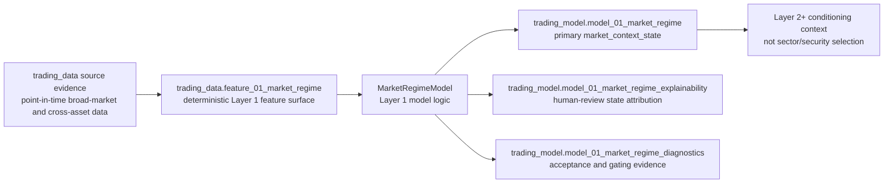

# M01 - Market Regime / MarketRegimeModel

This file records the active V2.2 direction-neutral market tradability/regime contract for Layer 1.

## Input

```text
trading_data.feature_01_market_regime
```

Layer 1 consumes broad-market and cross-asset evidence only. Sector/industry rotation, sector/industry ETF leadership, ETF holdings, selected securities, strategies, option contracts, portfolio actions, and future-return labels are excluded from production construction.

The upstream shared CSVs use `model_layer = layer_01_market_regime` to mark rows available to Layer 1 feature construction. Rows scoped to `layer_02_sector_context` belong to Layer 2 even when they live in the same static CSV asset.

## Timeframe contract

Layer 1 market context is horizon-aware. A current 1-minute market frame should not be trained to explain a 5-day market outcome, and a daily frame should not be treated as useful evidence for the next few minutes. Training and evaluation must pair each input frame with compatible future outcome horizons.

Accepted frame/horizon families:

```text
input_frame = 1min   -> prediction_horizon = 10min
input_frame = 10min  -> prediction_horizon = 1h
input_frame = 1h     -> prediction_horizon = 1D
input_frame = 1D     -> prediction_horizon = 1W
```

The target physical contract is one market-context row per `(available_time, input_frame, prediction_horizon, market_universe_ref)`. The same public state fields keep their compact `1_*` names inside each row; horizon and frame belong in row identity fields, not in duplicated column-name suffixes. Existing single-frame rows are a compatibility surface until the registry and SQL migration add the frame/horizon keys.

Future outcome metrics are labels and evaluation indicators only. They may calibrate whether a state output was useful for its paired horizon, but they must not enter same-row model construction.

## Stage flow



## Physical artifacts

```text
trading_model.model_01_market_regime
trading_model.model_01_market_regime_explainability
trading_model.model_01_market_regime_diagnostics
```

## `model_01_market_regime` - output

The primary output is the narrow downstream contract. It is keyed by `available_time` and describes whether the broad market / cross-asset background is clear, stable, low-transition-risk, liquid enough, and able to support downstream trading.

The accepted target key is:

```text
available_time
input_frame
prediction_horizon
market_universe_ref
```

Current fields:

```text
available_time
1_market_direction_score
1_market_direction_strength_score
1_market_trend_quality_score
1_market_stability_score
1_market_risk_stress_score
1_market_transition_risk_score
1_breadth_participation_score
1_correlation_crowding_score
1_dispersion_opportunity_score
1_market_liquidity_pressure_score
1_market_liquidity_support_score
1_coverage_score
1_data_quality_score
```

`1_market_direction_score` records broad current direction sign only. It is not a long/short instruction and is not a quality score.

`1_market_trend_quality_score`, `1_market_stability_score`, `1_market_transition_risk_score`, `1_market_liquidity_pressure_score`, `1_market_liquidity_support_score`, `1_coverage_score`, and `1_data_quality_score` must remain separate. Market tradability should not collapse direction, trend clarity, risk stress, liquidity pressure, coverage, and data quality into one ambiguous readiness field.

## Missing-data tolerance

Layer 1 must tolerate missing upstream observations when the absence is point-in-time explainable, for example a symbol that was not yet listed in the requested historical month, a provider returning a reviewed no-data response, or a signal family lacking enough minimum history. Missing data should reduce `1_coverage_score` / `1_data_quality_score`, appear in diagnostics, and may block promotion through coverage gates; it should not by itself crash deterministic model construction or force the pipeline to invent synthetic bars.

The model may degrade confidence or withhold downstream unlocks when coverage is too low, but absence must stay explicit as evidence. Valid no-data evidence is different from provider failure, schema failure, leakage, or unreviewed stale data.

## `model_01_market_regime_explainability` - explainability

Explainability owns human-review detail that should not become a hard downstream dependency. It uses one row per `(available_time, factor_name)` with:

```text
available_time
factor_name
factor_value
explanation_payload_json
```

`factor_name` stores the public state-output name being explained. `explanation_payload_json` owns semantic contract metadata, source signal-group references, signal counts, evidence-role references, config references, and future accepted reason-code detail.

## `model_01_market_regime_diagnostics` - diagnostics

Diagnostics owns acceptance, monitoring, and gating evidence. It uses one row per `available_time` with:

```text
available_time
present_state_output_count
missing_state_output_count
data_quality_score
diagnostic_payload_json
```

`diagnostic_payload_json` owns missingness/freshness, minimum-history, standardization and z-score clipping checks, feature coverage, data-quality decomposition, chronological split/refit stability, downstream usefulness versus baselines, and no-future-leak checks.

## Substrate promotion diagnostic

`src/models/model_01_market_regime/substrate_diagnostics.py` owns the reusable read-only substrate diagnostic for promotion-readiness triage. The stable script entrypoint is:

```bash
PYTHONPATH=src python3 scripts/models/model_01_market_regime/diagnose_model_01_market_regime_substrate.py
PYTHONPATH=src python3 scripts/models/model_01_market_regime/diagnose_model_01_market_regime_substrate.py --from-database --output-json /tmp/l1_substrate_diagnostic.json
```

The diagnostic emits `model_01_market_regime_substrate_diagnostic` and separates:

- source-bar sparsity by source symbol/timeframe decision-day coverage;
- feature lookback / non-null signal coverage gaps;
- model-output coverage and feature-to-model timestamp alignment gaps.

`--from-database` performs read-only SQL selects over source, feature, and model tables. It does not write source rows, feature rows, model rows, evaluation rows, promotion evidence, activation records, broker/account state, or storage lifecycle state. `1_coverage_score` and `1_data_quality_score` stay quality evidence and are excluded from predictive-output coverage counts.

## Naming rule

Layer 1 model fields use compact `1_*` names in docs, model-facing payloads, and SQL physical columns. SQL writers should quote numeric-leading column names when needed rather than storing semantic aliases such as `layer01_*`.

Use `docs/21_vector_taxonomy.md` for cross-layer terminology. Layer 1 outputs `market_context_state`; it does not output a target vector, sector vector, alpha confidence, or position instruction.

Downstream consumers must select the market context that matches their decision horizon. Intraday entry logic should prefer short-frame contexts, risk and position logic may combine intraday and daily contexts, and swing/multi-day target work should use daily-frame contexts rather than a single undifferentiated market state.

## Layer acceptance

Layer 1 changes are acceptable when they:

- preserve the broad-market-only boundary and exclude sector/security/strategy/option/portfolio outcome leakage;
- preserve the frame/horizon pairing rule and prevent short-frame evidence from being evaluated against unrelated long-horizon labels;
- keep `trading_data.feature_01_market_regime` as the production input and `trading_model.model_01_market_regime` / `market_context_state` as the narrow downstream output;
- keep explainability and diagnostics as review/support artifacts rather than hard downstream dependencies;
- keep direction, direction strength, trend quality, stability, risk stress, transition risk, liquidity pressure/support, coverage, and data quality semantically separate;
- provide evidence-backed verification for generation, evaluation, smoke, and promotion-review paths when implementation changes;
- route new shared names, statuses, fields, or reason-code vocabularies through `trading-manager/scripts/` before cross-repository dependence.

Current Layer 1 verification gates include:

```bash
python3 -m compileall -q src scripts tests
PYTHONPATH=src python3 -m unittest discover -s tests -v
PYTHONPATH=src python3 scripts/models/model_01_market_regime/generate_model_01_market_regime.py --help
PYTHONPATH=src python3 scripts/models/model_01_market_regime/diagnose_model_01_market_regime_substrate.py --help
PYTHONPATH=src python3 scripts/models/model_01_market_regime/diagnose_model_01_market_regime_substrate.py --from-database --output-json /tmp/l1_substrate_diagnostic.json
PYTHONPATH=src python3 scripts/models/model_01_market_regime/evaluate_model_01_market_regime.py --help
PYTHONPATH=src python3 scripts/models/model_01_market_regime/evaluate_model_01_market_regime.py
PYTHONPATH=src python3 scripts/models/model_01_market_regime/evaluate_model_01_market_regime.py --print-artifacts --output-json /tmp/l1_promotion_artifacts.json
PYTHONPATH=src python3 scripts/models/model_01_market_regime/evaluate_model_01_market_regime.py --from-database --output-json /tmp/l1_database_promotion_summary.json
PYTHONPATH=src python3 scripts/models/model_01_market_regime/run_market_regime_development_smoke.py --help
PYTHONPATH=src python3 scripts/models/model_01_market_regime/review_market_regime_promotion.py --help
PYTHONPATH=src python3 scripts/models/model_01_market_regime/review_market_regime_promotion.py --evaluation-summary-json /tmp/dev_smoke_summary.json --dry-run
PYTHONPATH=src python3 scripts/models/model_01_market_regime/review_market_regime_promotion.py --evaluation-summary-json /tmp/dev_smoke_summary.json --local-fallback-review
git diff --check
```

Runtime SQL smoke tests require an explicitly configured PostgreSQL target and should not run as default unit tests.

Current promotion-evidence scoring keeps `1_coverage_score` and `1_data_quality_score` as quality/gating evidence only; they must not be counted as predictive future-return factors when calculating Pearson, baseline-improvement, or split-stability promotion metrics. Missing model rows at label decision times are tracked as alignment/completeness evidence, not future leakage; leakage means label-time or split-order violations. The latest read-only database summary remains deferred rather than promoted: model-row count, eval-label count, model/label alignment, pair-count, coverage, correlation, baseline-improvement, and split-stability gates fail, while no-future-leak and chronological split-overlap checks pass.
